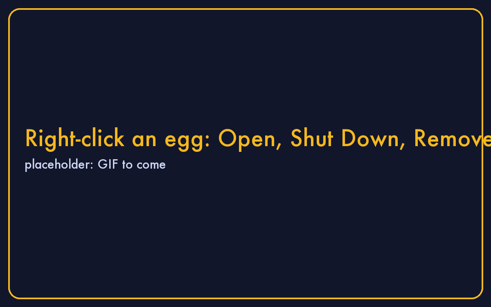
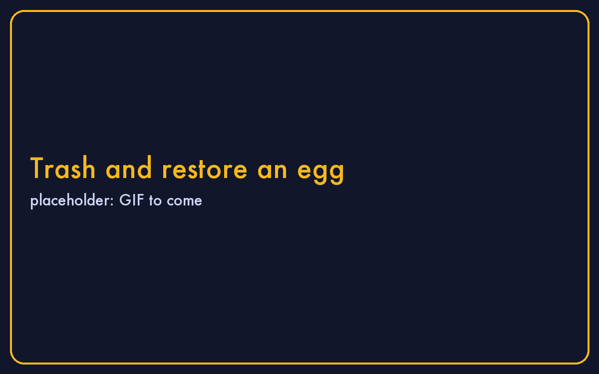

# Your desk

- **Double-click** an egg to download it, then to open it.
- **Right-click** for Open, Shut Down, Remove.
- **Remove** sends an egg to the Trash. Restore it from there, or download it fresh any time.

**Apps**, in the dock (⌘1), holds the tools. **⌘K** searches everything on the desk and the hub.
