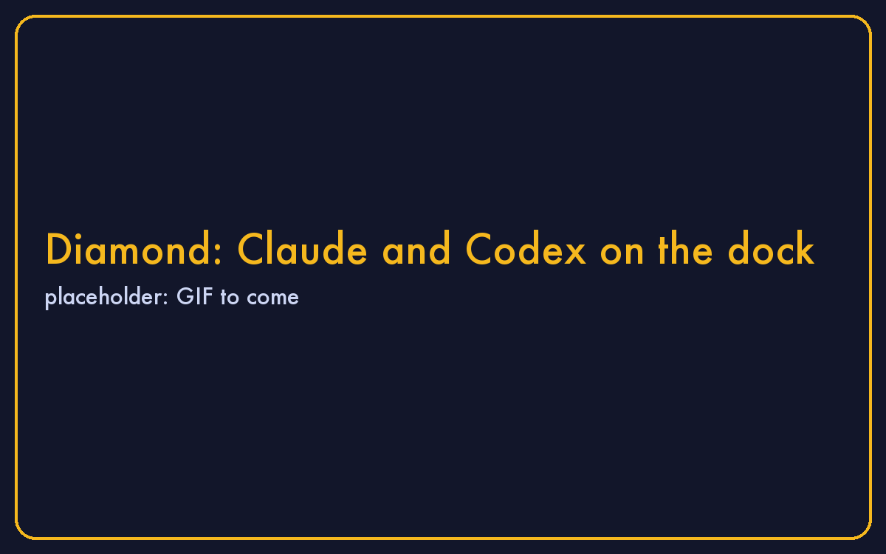

# Vibe coding in Diamond

Diamond Linux is the egg made for this. On its dock:

- **Claude** and **Codex** are the desktop apps. Click one, sign in with your own account.
- **Claude CLI** and **Codex CLI** open a terminal with the tool already running, for when you want to work in a folder.
- **Chrome**, **Files**, **Console** are what they say.

## Your first project

1. Click **Claude CLI** on the dock.
2. Type what you want: "make me a website for my bakery with a menu page".
3. Say yes when it asks to create files. Open **Files** to see them appear.
4. Ask for changes the same way. Nothing you do can touch your Mac.

## If the egg gets messy

Right-click its icon on the desk and choose **Remove**. It goes to the Trash; download it again for a clean start. Your Mac never notices.
