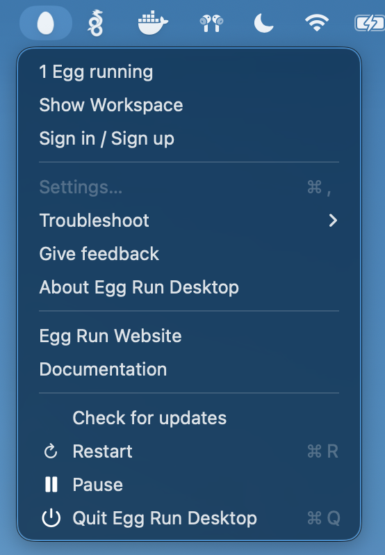

# The egg in the menu bar

Egg keeps running when you close the window. The egg in your menu bar is where it lives:

- **Egg running** tells you what is up.
- **Show Workspace** brings the desk back.
- **Pause** freezes every running egg where it is; **Restart** brings them back.
- **Troubleshoot** collects what support needs.
- **Quit** shuts the eggs down first, then the app.
